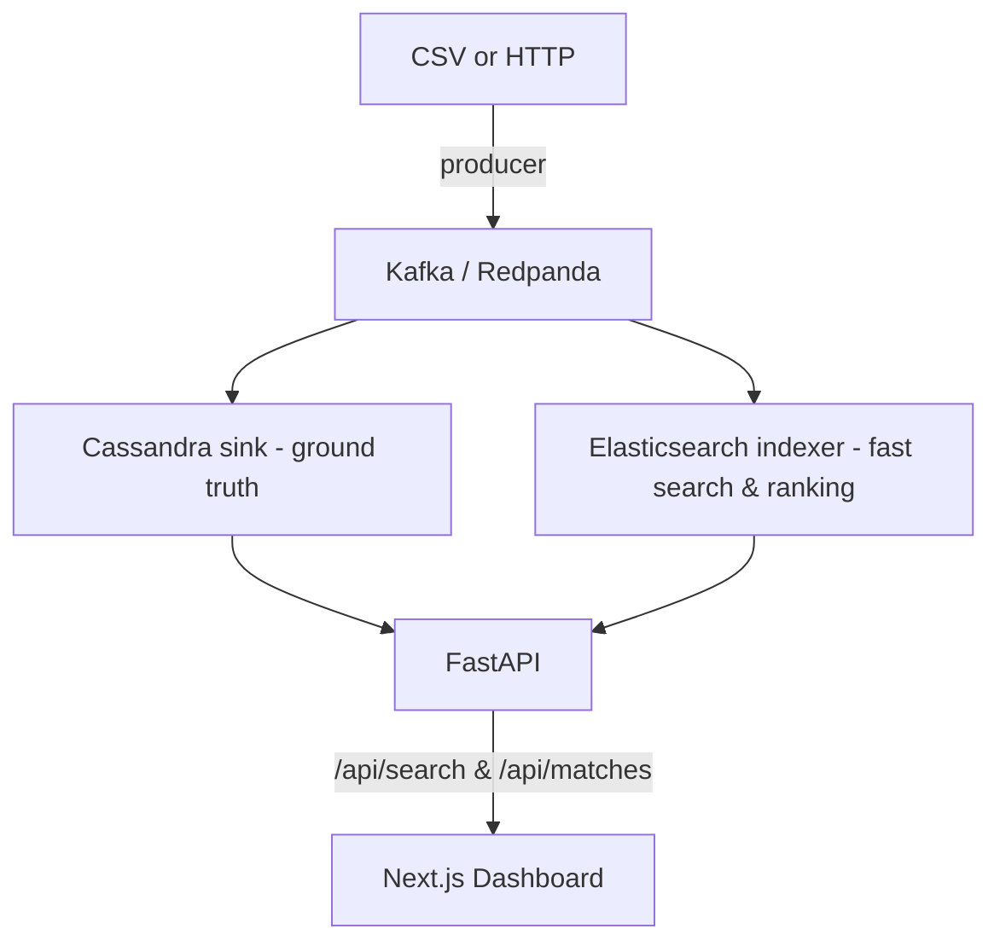

# 🤝 AI Mentor Matching Platform

Smarter mentor-mentee pairing from profile text.  
Streaming ingestion → real-time indexing → TF-IDF similarity → search & ranked matches: with a clean web UI and SDKs.

---

## 🧰 Tech Stack

<div style="display: flex; flex-wrap: wrap; gap: 16px;">
  
  
  
  
  
  
  
  
  
  
</div>

---

> **Educational project showcasing a production-style ML + streaming stack.**  
> Not intended for high-stakes decision making.

---

## 🔭 What it does

- Ingests student profile events (name, major, interests, hobbies) from CSV or HTTP into Kafka
- Writes normalized profiles to Cassandra and searchable vectors to Elasticsearch
- Builds TF-IDF vectors and computes cosine similarity for ranked mentor recommendations
- Serves a simple REST API (FastAPI) and a Next.js dashboard
- Ships with JS and Python SDKs, unit/integration tests, and a one-command local stack

---

## 🏗️ Architecture



---

## 📂 Repository layout

```
AI_matching_system/
├── apps/
│   └── dashboard/            # Next.js UI (pages, components, tests)
├── data/
│   ├── raw/student_profiles.csv
│   └── processed/            # derived artifacts (gitignored)
├── db/
│   ├── cassandra/schema.cql  # keyspace + table
│   └── elastic/mappings.json # index mappings
├── infra/
│   └── docker/api.Dockerfile # API container
├── packages/
│   ├── sdk-js/               # JS client + Jest tests
│   └── sdk-py/               # Python client
├── services/
│   ├── api/app/              # FastAPI app
│   ├── ingest/               # Kafka producers/consumers
│   │   ├── producers/csv_replay.py
│   │   └── consumers/{cassandra_sink.py, es_indexer.py}
│   └── ml/                   # TF-IDF model code
│       ├── tfidf.py
│       └── ranker.py
├── tests/
│   ├── unit/                 # fast tests (ML utils, API handlers)
│   └── integration/          # with running services
├── .env.example              # compose env
├── docker-compose.yml        # local stack
└── Makefile                  # dev workflow helpers
```

---

## ⚙️ Requirements

- Docker & Docker Compose
- Python 3.10+
- Node 18+ (for the dashboard and JS SDK)

---

## 🚀 Quickstart (local)

**1. Clone & seed dataset**
```sh
git clone https://github.com/aiskakov28/AI_matching_system.git
cd AI_matching_system
# Ensure data/raw/student_profiles.csv exists (place your CSV if needed)
```

**2. Bring up infra + API**
```sh
# uses .env.example by default
make up
```

**3. Start sinks (Kafka → Cassandra/Elastic)**
```sh
make consumers
```

**4. Replay CSV into Kafka**
```sh
make seed
```

**5. Open the API**
- http://localhost:8000/docs

**6. Run the dashboard (optional)**
```sh
cd apps/dashboard
npm install
npm run dev
# http://localhost:3000   (NEXT_PUBLIC_API defaults to http://localhost:8000)
```

**7. Logs & cleanup**
```sh
make logs       # follow API logs
make down       # stop and wipe volumes
```

---

## 🧪 Testing

**Python unit tests**
```sh
make test-unit
```

**Integration tests (API against running stack)**
```sh
make test-int
```

**JS SDK tests**
```sh
cd packages/sdk-js
npm install
npm test
```

---

## 🗃️ Data model

**Input CSV** (`data/raw/student_profiles.csv`)

| column              | example                      |
|---------------------|-----------------------------|
| full_name           | John Doe                    |
| major               | Computer Science            |
| class_year          | 2028                        |
| academic_interests  | Natural Language Processing |
| hobbies             | Chess                       |

**Cassandra schema (simplified):**
```sql
CREATE KEYSPACE IF NOT EXISTS mentor
  WITH REPLICATION = {'class': 'SimpleStrategy', 'replication_factor': 1};

CREATE TABLE IF NOT EXISTS mentor.profiles (
  id UUID PRIMARY KEY,
  full_name TEXT,
  major TEXT,
  class_year INT,
  academic_interests TEXT,
  hobbies TEXT,
  created_ts TIMESTAMP
);
```

**Elasticsearch mapping (excerpt):**
```json
{
  "mappings": {
    "properties": {
      "full_name": { "type": "text" },
      "major": { "type": "keyword" },
      "class_year": { "type": "integer" },
      "text_blob": { "type": "text" }  // interests + hobbies tokenized for TF-IDF/search
    }
  }
}
```

---

## 🧠 Matching logic

- Build TF-IDF vectors on `text_blob = major + " " + academic_interests + " " + hobbies`
- Compute cosine similarity
- Combine signals (e.g., extra weight on major matches) and rank mentors per mentee
- Cache top-K in Elasticsearch for fast retrieval

**See:**
- `services/ml/tfidf.py` – vectorizer utilities
- `services/ml/ranker.py` – similarity & ranking helpers
- `services/ingest/consumers/*` – Cassandra + ES writers

---

## 🔌 API

**Base URL:** http://localhost:8000

- `GET /healthz` → `{ "ok": true }`
- `GET /search?q=<text>&k=10` → fuzzy search across profiles
- `GET /matches?mentee=<full_name>&k=5` → ranked mentors for a mentee
- `POST /profiles` → add/update a profile (propagates to Kafka → sinks)
- OpenAPI docs: `/docs`

---

## 🧩 SDKs

**JS**
```js
import { search, matches } from "@mentor/sdk"

const res = await search("computer vision", 10)
const top = await matches("Alice Smith", 5)
```

**Python**
```python
from mentor_sdk import Client

c = Client()  # defaults to http://localhost:8000
print(c.search("data science", k=10))
print(c.matches("Alice Smith", k=5))
```

---

## 🔐 Configuration

Edit `.env.example` (Compose reads this file):

```
# Kafka (Redpanda)
KAFKA_BROKERS=redpanda:9092
KAFKA_TOPIC=profiles.events

# Cassandra
CASSANDRA_HOSTS=cassandra
CASSANDRA_KEYSPACE=mentor

# Elasticsearch
ELASTIC_HOST=http://elasticsearch:9200
ELASTIC_INDEX=mentor_profiles

# API
API_HOST=0.0.0.0
API_PORT=8000
```

---

## 🧭 Development tips

- **Rebuild API image after code changes:**
  ```sh
  docker compose build api && docker compose up -d api
  ```

- **Reset state:**
  ```sh
  make down && make up && make consumers && make seed
  ```

- **Point the dashboard to a remote API:**
  ```sh
  NEXT_PUBLIC_API=https://your-host/api npm run dev
  ```

---

## ☁️ Cloud notes (GCP-friendly)

The local Docker stack mirrors managed services you can swap in on GCP:

- Kafka → Confluent Cloud / Redpanda Cloud
- Cassandra → DataStax Astra DB or self-managed on GKE
- Elasticsearch → Elastic Cloud
- API/UI → Cloud Run or GKE
- CI → GitHub Actions (unit/integration), add k6/Locust for load tests

---

## 🗺️ Roadmap

- Bi-encoder transformer embeddings (e.g., all-MiniLM) with ANN search
- Feedback loop and online learning
- Role-based access and audit logs
- Feature store + model monitoring (drift/quality)

---

## 🤝 Contributing

PRs welcome:

```sh
git checkout -b feat/my-improvement
git commit -m "feat: add X"
git push origin feat/my-improvement
```

---

## 📜 License

MIT — see [LICENSE](LICENSE).

---

## 🧾 Acknowledgments

Built to demonstrate an end-to-end ML + streaming architecture with approachable tools and a production-like developer experience.
